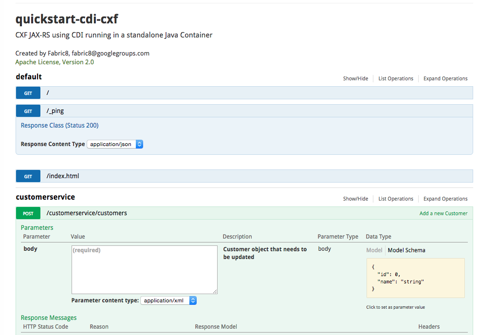
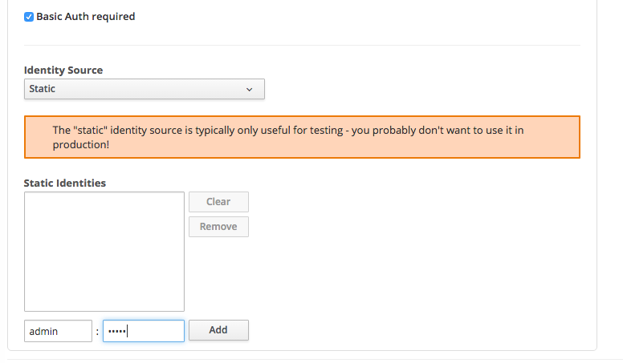

## Importing a service from Fabric8 and publishing it to the gateway

Let's assume you have deployed the CxfCdi quickstart in Fabric8 and that you created your organization in apiman. You can now navigate to the Organization/Service page to 'Import Services' into apiman. Apiman will obtain a list of running services in your namespace that match your search string. Use '*' to match all service. 

.

Go through the wizzard and select import as 'Public Service' as we don't yet have any Plans or Policies set up. Note that we can add those later if needed. Please notice that after the import is complete, the service has discovered the serviceUrl, serviceType, descriptionUrl and descriptionType. When the service was published to Kubernetes the service developer added this information using Kubernetes Service Annotations.

### Kubernetes Service Annotations

Kubernetes allows the creation of Service Annotations. Here we propose the use of the following annotations

* 'apiman.io/servicepath' - the path part of the service endpoint url. An example value could be 'cxfcdi',

* 'apiman.io/servicetype' - the protocol of the service. Example values can be 'SOAP' or 'REST',

* 'apiman.io/servicescheme' - the scheme of service endpoint url which can be 'http' or 'https' (defaults to 'http')

* 'apiman.io/descriptionpath' - the path part of the service description document’s endpoint. It is a pretty safe assumption that the service self documents. An example value for a swagger 2.0 document can be 'cxfcdi/swagger.json',

* 'apiman.io/descriptiontype' - the type of Description Language used. Example values supported by apiman are 'WSDL', 'WADL', 'SwaggerJSON', 'SwaggerYAML'.

The fragment below is taken from the service section of the kubernetes.json were these annotations are used

    ...
    "objects" : [ {
      "apiVersion" : "v1",
      "kind" : "Service",
      "metadata" : {
        "annotations" : {
          "apiman.io/servicepath" : "cxfcdi",
          "apiman.io/servicetype" : "REST",
          "apiman.io/descriptionpath" : "cxfcdi/swagger.json",
          "apiman.io/descriptiontype" : "SwaggerJSON"
      },
    ...

The [fabric8-maven-plugin](http://fabric8.io/gitbook/mavenPlugin.html) makes it easy to define these annotations as properties in your project's pom. Simply add a property that is prefixed with 'fabric8.annotations.service.'. In the [CdiCxf project](https://github.com/fabric8io/ipaas-quickstarts/blob/v2.2.50/quickstart/cdi/cxf/pom.xml#L59-L62) mentioned above this looks like

    ...
    <fabric8.annotations.service.apiman.io.servicePath>cxfcdi</fabric8.annotations.service.apiman.io.servicePath>
    <fabric8.annotations.service.apiman.io.serviceType>REST</fabric8.annotations.service.apiman.io.serviceType>
    <fabric8.annotations.service.apiman.io.descriptionPath>cxfcdi/swagger.json</fabric8.annotations.service.apiman.io.descriptionPath>
    <fabric8.annotations.service.apiman.io.descriptionType>SwaggerJSON</fabric8.annotations.service.apiman.io.descriptionType>
    ...
    
By convention the part _after_ the prefix is the annotation key, and if the key contains a '.', everything before that last dot turns into the namespace. So, for example, 'apiman.io.servicePath' turns into 'apiman.io/servicePath' in the kubernetes.json.

### Swagger

If your service has a Swagger 2.0 endpoint the service import can set the swagger.json or you can manually paste the swagger.json into the service definition

.

Service consumers will be presented with a link to the service definition api document

.

which is a full description of the API of the service along with sample requests, responses statuses and exceptions.

.

### Applying a Policy to a 'Public Service'

A service can be published to the gateway without any policies but it makes sense to configgure at least an authentication policy. Navigate to the Policy screen on the Service and select Add Policy. In the dropdown select a Basic Authentication policy, and select 'Basic Auth Required' and add a Static Identity and a  user/password pair.

.

### Publishing the service to the gateway

