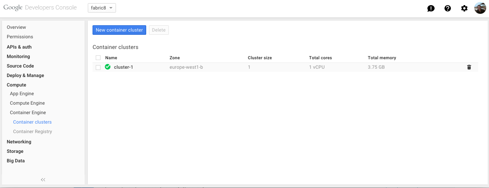
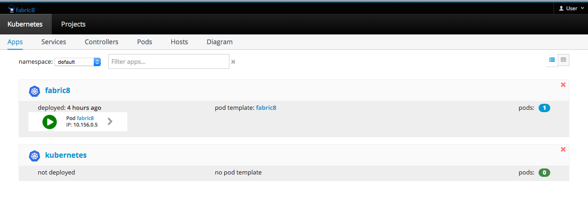

## Getting Started with Kubernetes on Google Container Engine

It is very easy to get up and running with Google Container Engine (GKE) and the docs are extremely well structured.  Before you start you should read the short GKE [overview](https://cloud.google.com/container-engine/docs/#overview) and especially familiarise yourself with the [pricing](https://cloud.google.com/container-engine/docs/#pricing) information!

### Before you begin
To start you will need to sign up for an account, enable billing and install on your local machine the gcloud and kubectl client binaries.  All this can be done by following the [Google before you begin guide](https://cloud.google.com/container-engine/docs/before-you-begin).

To make things easier to type we use we've been using an alias pointing to where the google-cloud-sdk was downloaded for `kubectl` so we can just call `kc`..

    alias kc=~/google-cloud-sdk/bin/kubectl

### Creating a container cluster

Now you are ready to create a cluster on GKE.  To start with we recommend creating a cluster of one instance which can be used to familiarise yourself with the architecture and components without incurring too much cost.  You can easily build up the cluster later.

Follow this guide to create your cluster [creating a container cluster](https://cloud.google.com/container-engine/docs/clusters/operations#creating_a_container_cluster)

Again to start with we recommend choosing a low spec machine such as n1-standard-1 (1 vCPU, 3.75 GB memory).

Now that you have created your cluster you should be able to use your `kc` alias from the "Before you begin step" above to interact with your new Kubernetes instance, for example..

    kc get pods

### Install the fabric8 console

Now there wont be anything running yet so lets install the fabric8 console, run as a [replication controller](https://cloud.google.com/container-engine/docs/replicationcontrollers/) and include a [service](https://cloud.google.com/container-engine/docs/services/).  We will also install another pod that includes a base set of template apps that we can run later.  So now run..

    kc create -f http://central.maven.org/maven2/io/fabric8/apps/console-kubernetes/2.2.10/console-kubernetes-2.2.10-kubernetes.json

To explain what just happened a little, we downloaded a kubernetes.json configuration file which describes a [replication controller](https://cloud.google.com/container-engine/docs/replicationcontrollers/) for the fabric8-console docker image.  This file is generated as part of the fabric8 release process.  The kubernetes CLI created this replication controller called fabric8 which then instructed the API server to schedule a pod on a node in our cluster.  The image may take a little while to download from docker hub.  If you want to build and push the image to your Google registry then see the relevant section below.

### Accessing the API server from your local machine

In the short term (we're working on an improved way to access the console) we can view the console using the Kubernetes API server, service proxy.

After we logged in earlier using `gcloud beta container get-credentials` it created a config file in your user home directory...

    cat ~/.kube/config

in here you can see the API server address under `server:` whis we will use later in this step when we refer to `$API_SERVER_IP`.  Currently the API server uses basic auth to authenticate so at the bottom of the `~/.kube/config` file you will also see the admin username and password that you can use.

You will then be able to access the API server from you browser after accepting the certificate, for example to view the Kubernetes swagger UI...

    https://$API_SERVER_IP/swagger-ui

now to view the fabric8 console go to...

    https://$API_SERVER_IP/api/v1/proxy/namespaces/default/services/fabric8/

### Container Registry

Your GKE project has a [container registry](https://cloud.google.com/tools/container-registry/) that you can use to push images to and reference in you kubernetes configurations.  This is useful if you want to avoid pulling images from dockerhub and also when developing custom images.

For example lets take the fabric8-console itself...

#### Clone and build

    git clone git@github.com:fabric8io/fabric8-console.git
    cd fabric8-console
    npm install -g bower gulp
    npm install
    bower update
    rm -Rf site.*
    gulp bower
    gulp site

#### Docker build, tag and push to your projects Google registry

    docker build --rm -t gcr.io/fabric8-984/fabric8-console .
    gcloud docker push gcr.io/fabric8-984/fabric8-console

#### Modify the console kubernetes.json, search for `image` and replace the name with the tagged name above

    "image" : "gcr.io/fabric8-984/fabric8-console"
